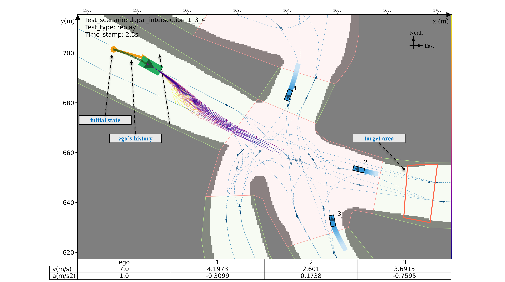

    
    <h1 align="center">Dynamic Scenario Planning Task for the MineSim project</h1>

> **MineSim: Scenario-Based Simulator for Autonomous Truck Planning in Open-Pit Mines**  
> For more information, refer to the [MineSim Project Homepage](https://buaa-trans-mine-group.github.io/minesim/).

# MineSim-Dynamic

Scenario Library and Benchmark for Dynamic Obstacle Avoidance Planning in Open-Pit Mines.

This library focuses on testing obstacle avoidance in mixed traffic at mining intersections. Its scenarios feature unstructured intersections with varying slopes and irregular shapes, where autonomous mining trucks interact with other vehicles. The main goal is to assess the trucks’ smooth obstacle avoidance.

## :fire: TODO

- [x] Initialize MineSim-Dynamic repository, 2024.12.20;
- [x] Update repository documentation, 2025.01.23;
- [ ] Release full codebase (TBD);

## Dynamic Obstacle Planning Task in MineSim

The dynamic obstacle avoidance planning problem is first defined for each scenario. A complete test task includes the vehicle parameters, the ego vehicle's state update model, the initial states, the target states, and the other agents' state update policy. As shown in Figure below, the ego vehicle's reference point is the rear axle center, with the initial state (denoted as ${{\bf{x}}_0} = [{x_0},{y_0},{\theta _0},{v_0}{\rm{,}}{\gamma _0},{a_0},{\delta _0}]$, representing x and y positions, yaw, speed, yaw rate, acceleration, and front wheel steering angle) indicated by a yellow arrow. The target area, marked by an orange polygon, represents the region the vehicle must navigate to complete the task.

Figure 1: Dynamic obstacle planning task configuration

## Benchmark Algorithms in MineSim

For the obstacle avoidance problem in scenarios with dynamic obstacles, we provide three benchmark algorithms:

- IDM, rule-based longitudinal Intelligent Driving Model (IDM) [1].
- FOP, Frenet-based Optimal Planner (FOP) [2].
- SPMM, Sampling Planner using Predefined Maneuver Modes (SPPMM) [3].The SPPMM algorithm is an improvement of the FOP.

> [1] Treiber M, Hennecke A, Helbing D. Congested traffic states in empirical observations and microscopic simulations[J]. Physical Review E, 2000, 62(2): 1805-1824.
> [2] Werling M, Ziegler J, Kammel S, et al. Optimal trajectory generation for dynamic street scenarios in a Frenet frame[C]. IEEE, 2010: 987-993.
> [3] Chen Z, Yu G, Chen P, et al. MineSim: A scenario-based simulation test system and benchmark for autonomous trucks in open-pit mines[J]. Accident Analysis and Prevention, 2025, 213: 107938.

Researchers may combine evaluation metrics from our [MineSim Project Homepage](https://buaa-trans-mine-group.github.io/minesim/) or reference paper[3] for comprehensive algorithm assessment.

### Qualitative Result

todo

## :truck: Usage Instructions

### 1. Preparation

> **Note**: System Requirements: Ubuntu 20.04 LTS recommended

- **Clone Repository**.

- **Download HD map in MineSim**.
  MineSim HD Maps v1.6: https://github.com/byChenZhifa/archive/tree/main/minesim/minesim-maps-v1_6

- **Download scenario library datasets**
  todo
- Recommended Project Structure

todo

### 2. Python Environment Configuration

todo

## :tada: Acknowledgements

We would like to express our sincere thanks to the authors of the following tools and packages:

- **CommonRoad**: a collection of composable benchmarks for motion planning on roads; [Link](https://commonroad.in.tum.de/).
- **nuPlan**: The world's first benchmark for autonomous vehicle planning; [Link](https://www.nuscenes.org/nuplan).
- **OnSite**: structured road test tool; [Link](https://github.com/yangyh408/onsite-structured-test).

## :tada: License

Distributed under the MIT License. See [LICENSE](https://opensource.org/licenses/MIT) for details.

## :tada: Disclaimer

This is research code, distributed in the hope that it will be useful, but **WITHOUT ANY WARRANTY**; without even the implied warranty of merchantability or fitness for a particular purpose.
