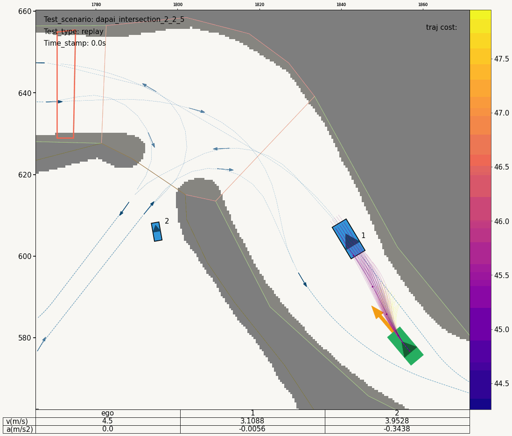

<p align="center">
    
    <h1 align="center">Dynamic Scenario Planning Task for the MineSim project</h1>
</p>

> **MineSim: Scenario-Based Simulator for Autonomous Truck Planning in Open-Pit Mines** > <br>
> For more information, refer to the [MineSim Project Homepage](https://buaa-trans-mine-group.github.io/minesim/).

# MineSim-Dynamic

Scenario Library and Benchmark for Dynamic Obstacle Avoidance Planning in Open-Pit Mines.

This library focuses on testing obstacle avoidance in mixed traffic at mining intersections. Its scenarios feature unstructured intersections with varying slopes and irregular shapes, where autonomous mining trucks interact with other vehicles. The main goal is to assess the trucks’ smooth obstacle avoidance.

## :fire: TODO

- [x] Initialize MineSim-Dynamic repository, 2024.12.20;
- [x] Update repository documentation, 2025.01.23;
- [x] Release full codebase, including Chinese language comments, 2025.01.25;
- [ ] Release full codebase, complete English version (TBD);

## Dynamic Obstacle Planning Task in MineSim

The dynamic obstacle avoidance planning problem is first defined for each scenario. A complete test task includes the vehicle parameters, the ego vehicle's state update model, the initial states, the target states, and the other agents' state update policy. As shown in Figure below, the ego vehicle's reference point is the rear axle center, with the initial state (denoted as ${{\bf{x}}_0} = [{x_0},{y_0},{\theta _0},{v_0}{\rm{,}}{\gamma _0},{a_0},{\delta _0}]$, representing x and y positions, yaw, speed, yaw rate, acceleration, and front wheel steering angle) indicated by a yellow arrow. The target area, marked by an orange polygon, represents the region the vehicle must navigate to complete the task.


Figure 1: Dynamic obstacle planning task configuration

## Benchmark Algorithms in MineSim

For the obstacle avoidance problem in scenarios with dynamic obstacles, we provide three benchmark algorithms:

- IDM, rule-based longitudinal Intelligent Driving Model (IDM) [1].
- FOP, Frenet-based Optimal Planner (FOP) [2].
- SPPMM, Sampling Planner using Predefined Maneuver Modes (SPPMM) [3].The SPPMM algorithm is an improvement of the FOP.

> [1] Treiber M, Hennecke A, Helbing D. Congested traffic states in empirical observations and microscopic simulations[J]. Physical Review E, 2000, 62(2): 1805-1824.
> [2] Werling M, Ziegler J, Kammel S, et al. Optimal trajectory generation for dynamic street scenarios in a Frenet frame[C]. 2010 IEEE International Conference on Robotics and Automation(ICRA 2010): 987-993.
> [3] Chen Z, Yu G, Chen P, et al. MineSim: A scenario-based simulation test system and benchmark for autonomous trucks in open-pit mines[J]. Accident Analysis and Prevention, 2025, 213: 107938.

Researchers may combine evaluation metrics from our [MineSim Project Homepage](https://buaa-trans-mine-group.github.io/minesim/) or reference paper[3] for comprehensive algorithm assessment.

### Qualitative Result

#### FOP planner demo in scenario id: dapai_intersection_2_2_5

set file :`MineSim-Dynamic/devkit/script/config/sim_engine/simulation_mode_1_default_replay_test_mode.yaml`



#### FOP planner demo in scenario id: jiangtong_intersection_9_3_2

set file :`MineSim-Dynamic/devkit/script/config/sim_engine/simulation_mode_1_default_replay_test_mode.yaml`


## :truck: Usage Instructions

### 1. Preparation

> **Note**: System Requirements: Ubuntu 20.04 LTS recommended

- **Clone Repository**.

- **Download HD map in MineSim**.
  This dataset (MineSim HD Maps v1.6) is available at : https://github.com/byChenZhifa/archive/tree/main/minesim/minesim-maps-v1_6

  ```bash
  # Map files structure in project
  maps
  ├── bitmap
  │ ├── guangdong_dapai_bitmap_mask.png
  │ ├── jiangxi_jiangtong_bitmap_mask.png
  ├── other_figure # Some supplements for understanding the scenario of open-pit mines
  │ ├── guangdong_dapai_aerialpicture_1.JPG
  │ ├── guangdong_dapai_aerialpicture_2.JPG
  │ ├── guangdong_dapai_borderline_2D.fig
  │ ├── guangdong_dapai_semantic_map.png
  │ ├── jiangxi_jiangtong_aerialpicture.jpg
  │ ├── jiangxi_jiangtong_borderline_2D.fig
  │ ├── jiangxi_jiangtong_borderline_3D.fig
  │ ├── jiangxi_jiangtong_borderline_referencepath_2D.fig
  │ ├── jiangxi_jiangtong_borderline_referencepath_3D.fig
  │ └── jiangxi_jiangtong_semantic_map.png
  └── semantic_map
  ├── guangdong_dapai_semantic_map.json
  ├── jiangxi_jiangtong_semantic_map.json
  └── local_origin_info.py
  ```

- **Download scenario library datasets**

  - demo scenario :

    ```bash
    MineSim-Dynamic/inputs
    ├── Scenario-dapai_intersection_1_3_4.json
    └── Scenario-jiangtong_intersection_9_3_2.json

    ```

  - all scenario: TODO, coming soon.

- Recommended Project Structure

  - MineSim-Dynamic-vscode, It is recommended to use VSCODE.

    ```bash
    MineSim-Dynamic-vscode$ tree -L 2
    .
    ├── datasets
    │   ├── maps
    │   └── scenario-library-all
    └── MineSim-Dynamic # git clone
        ├── code_formatting_tool # Some code normalization tools
        ├── devkit # The core developer toolbox of Minesim
        ├── figures
        ├── inputs # Input directory (including two demo scenarios)
        ├── other_scripts
        ├── outputs # Output directory (log file automatically generated)
        ├── README.md
        └── setup # Python virtual environment setup

    ```

  - MineSim-Dynamic code Structure:

    ```bash
    czf@buaa:~/project_czf/20240901-MineSim/MineSim-Dynamic-vscode/MineSim-Dynamic$ tree -L 2
    .
    ├── code_formatting_tool
    ├── devkit
    │   ├── common # Some public classes, third-party libraries, etc;
    │   ├── configuration # Some configuration files for the simulation Engine;
    │   ├── database # Extract the scenes from the dataset of the scene library;
    │   ├── metrics_tool # Core Component 1 of minesim: Metric Evaluation System Tool/Component;
    │   ├── other # Other scripts that facilitate intermediate debugging and development;  `MineSim-Dynamic/devkit/other/minesim_devkit_import_list.py` includes most of the classes, functions, etc. that can be imported from the devkit root directory of minesim-dynamic; it uses YMAL format files for most configurations;
    │   ├── scenario_builder
    │   ├── script # The core script of mine, where more simulation loop configuration files can be modified, added, and extended in the  files:`MineSim-Dynamic/devkit/script/config/sim_engine`;
    │   ├── sim_engine # The core component 2 of minesim: the simulation engine component; simss is the core of the simulation loop, including modules such as Environment Manager, Prediction Algorithm, Planning Algorithm, Motion Controller, Ego Update Model, Agent Update Policy, and Test Logger. All of these components support secondary development
    │   ├── utils
    │   └── visualization # Core Component 3 of minesim: Visualization Tool/Component;
    ├── inputs
    │   ├── Scenario-dapai_intersection_1_3_4.json
    │   └── Scenario-jiangtong_intersection_9_3_2.json
    ├── LICENSE
    ├── other_scripts
    │   ├── gif_generateor_simple.py
    │   └── gif_generateor_simple_svg.py
    ├── outputs
    │   ├── log_file_list.csv
    │   ├── outputs_figure
    │   └── outputs_log
    ├── README.md
    └── setup
        └── requirements.txt

    ```

    ```bash
    MineSim-Dynamic-vscode/MineSim-Dynamic$ tree -L 1 devkit/sim_engine/
    devkit/sim_engine/
    ├── callback
    ├── ego_simulation
    ├── environment_manager
    ├── history
    ├── log_api
    ├── main_callback
    ├── map_manager
    ├── observation_manager
    ├── path
    ├── planning
    ├── prediction
    ├── runner
    ├── scenario_manager
    └── simulation_time_controller
    ```

### 2. Python Environment Configuration

- set python virtual environment:

  It is recommended to use `conda` for python virtual environment management;

  Note: The test has been conducted in Python 3.9;

  ```bash
  conda create -n minesim python=3.9
  ```

- Install dependency packages using `pip`:

  ```bash
  pip install -r ./requirements.txt
  # or
  pip install -r ./requirements.txt -i https://pypi.tuna.tsinghua.edu.cn/simple
  ```

- Activate the environment: `conda activate minesim `

### 3. A quick start demo of using Minesim

- Modify the dataset (HD map ) directory and other key data directories of the project once:`MineSim-Dynamic/devkit/configuration/sim_engine_conf.py`

  Note: It is recommended to use an absolute directory to ensure that the data can be read;

  ```python
  # MineSim-Dynamic/devkit/configuration/sim_engine_conf.py
  SimConfig = {
      "BASE_DEVKIT_PATH": "/home/czf/project_czf/20240901-MineSim/MineSim-Dynamic-vscode/MineSim-Dynamic/devkit",
      "other_conf": {
          "is_visualize": True,
          "is_save_fig": True,
          "is_record_sim_log": True,
          "is_skip_exist_scene": False,
      },
      "directory_conf": {
          "dir_datasets": get_config_directory(
              dir_name="dir_datasets",
              specified_dir="/home/czf/project_czf/20240901-MineSim/MineSim-Dynamic-vscode/datasets",
          ),
          "dir_maps": get_config_directory(
              dir_name="dir_maps",
              specified_dir="/home/czf/project_czf/20240901-MineSim/MineSim-Dynamic-vscode/datasets/maps",
          ),
          "dir_inputs": get_config_directory(dir_name="dir_inputs"),
          "dir_outputs": get_config_directory(dir_name="dir_outputs"),
          "dir_outputs_log": get_config_directory(dir_name="dir_outputs_log"),
          "dir_outputs_figure": get_config_directory(dir_name="dir_outputs_figure"),
      },
      "skip_exist_scene": True,
  }
  ```

- Code entry: `MineSim-Dynamic/devkit/script/run_simulation.py`

  The main requires the configuration file name of the simulation engine. For example:`simulation_mode_1_default_replay_test_mode`

  ```python
  if __name__ == "__main__":
      # SIMULATION MODE Choice
      # simulation_mode_0
      # simulation_mode_1_default_replay_test_mode
      # simulation_mode_2_interactive_test_mode
      # simulation_mode_3
      # simulation_mode_4
      # simulation_mode_5
      # simulation_mode_6
      main(config_name="simulation_mode_1_default_replay_test_mode")
  ```

  Note: Configuration file directory of the simulation engine: `MineSim-Dynamic/devkit/script/config/sim_engine`

- Start running the simulation process:

  ```bash
  (minesim) czf@buaa:~/project_czf/20240901-MineSim/MineSim-Dynamic-vscode/MineSim-Dynamic/devkit/script/$ python run_simulation.py
  ```

- The simulation results are automatically saved in the following directory:`MineSim-Dynamic/outputs`

  ```bash
  MineSim-Dynamic-vscode/MineSim-Dynamic$ tree -L 2 outputs/
  outputs/
  ├── log_file_list.csv
  ├── outputs_figure
  │   ├── gif_cache_png
  │   └── gif_cache_svg
  └── outputs_log
      ├── log_2025-01-15_11-27-39_9d2ee8b2
      ├── log_2025-01-15_11-29-41_31888065
      ├── log_2025-01-15_11-29-54_e5843244
      ├── log_2025-01-15_11-30-32_ca73121e
  ```

- Visualization results:

  - Modify the configuration of the visualized input log file: `MineSim-Dynamic/devkit/visualization_tool/configuration/visualizer_conf.py`

    All results are stored in the file `MineSim-Dynamic/outputs/log_file_list.csv`, with the following information about the storage:

    ```csv
    number,date,log_file_path
    xxxx,xxxx,xxxx
    xxxx,xxxx,xxxx
    ```

  - Run the visualization script to generate scene results for each frame of the simulation process: `MineSim-Dynamic/devkit/visualization_tool/run_visualizer.py`

    ```bash
    (minesim) czf@buaa:~/project_czf/20240901-MineSim/MineSim-Dynamic-vscode/MineSim-Dynamic/devkit/visualization_tool/$ python run_visualizer.py
    ```

  - The result is saved in: `MineSim-Dynamic/outputs/outputs_figure`

## :tada: Acknowledgements

We would like to express our sincere thanks to the authors of the following tools and packages:

- **CommonRoad**: a collection of composable benchmarks for motion planning on roads; [Link](https://commonroad.in.tum.de/).
- **nuPlan**: The world's first benchmark for autonomous vehicle planning; [Link](https://www.nuscenes.org/nuplan).
- **OnSite**: structured road test tool; [Link](https://github.com/yangyh408/onsite-structured-test).

## :tada: License

Distributed under the MIT License. See [LICENSE](https://opensource.org/licenses/MIT) for details.

## :tada: Disclaimer

This is research code, distributed in the hope that it will be useful, but **WITHOUT ANY WARRANTY**; without even the implied warranty of merchantability or fitness for a particular purpose.
